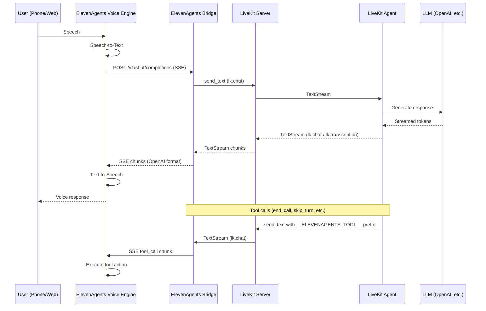

# ElevenAgents LiveKit Plugin

[](https://pypi.org/project/elevenagents-livekit-plugin/)
[](https://pypi.org/project/elevenagents-livekit-plugin/)

Bridge between LiveKit Agents and ElevenAgents Voice Orchestration.

Give your existing LiveKit agent a voice. No rewrite needed.

## Features

- **Minimal agent changes** -- add voice to any existing LiveKit text agent with just two lines of code, plus a bridge setup
- **Per-conversation isolation** -- each conversation gets its own LiveKit room and agent session
- **Single-process mode** -- embed the bridge directly into your agent with `bridge.embed(server)`
- **Real-time streaming** -- low-latency text streaming between your agent and ElevenAgents
- **Built-in voice tools** -- end calls, pause turns, switch languages out of the box
- **Any LLM** -- works with OpenAI, Anthropic, or any LLM supported by LiveKit Agents
- **Any LiveKit deployment** -- compatible with both LiveKit OSS and LiveKit Cloud
- **OpenAI-compatible API** -- exposes a standard `/v1/chat/completions` SSE endpoint
- **Auto session cleanup** -- idle sessions are automatically disconnected after 5 minutes

## What Changes in Your Agent

Two changes to your agent, plus a bridge that connects it to ElevenAgents.

**Agent changes (two lines):**

```diff
  # your existing agent.py
  from livekit.agents import Agent, AgentServer, AgentSession, JobContext, cli, room_io
  from livekit.plugins import openai
+ from elevenagents_livekit_plugin import ElevenAgentsBridge, elevenagents_tools

  class MyAgent(Agent):
      def __init__(self):
          super().__init__(
              instructions="You are a helpful assistant.",
+             tools=[*elevenagents_tools()],
          )
```

**Bridge setup (embed into same process):**

```python
bridge = ElevenAgentsBridge(room_name="elevenagents", port=8013)
bridge.embed(server)
```

Your agent logic, your LLM, your prompts, your custom tools -- everything stays the same. The plugin handles all the plumbing between your agent and ElevenAgents voice.

### What you keep

- Your existing agent code, untouched
- Your LLM choice (OpenAI, Anthropic, or anything LiveKit supports)
- Your custom tools and business logic
- Your LiveKit deployment (OSS or Cloud)

### What you get

- Voice input and output through ElevenAgents
- Built-in voice tools: end the call, pause, switch languages
- Real-time streaming with low latency
- Works with both LiveKit OSS and LiveKit Cloud

## Installation

```bash
pip install elevenagents-livekit-plugin
```

## Architecture



```
+-------------------+       +---------------------+       +------------------+
|                   |  SSE  |                     | Text  |                  |
|  ElevenAgents       |<----->|  ElevenAgents       |<----->|  LiveKit         |
|  Voice Engine     |       |  Bridge             |       |  Server          |
|                   |       |  (FastAPI on :8013)  |       |                  |
+-------------------+       +---------------------+       +------------------+
                                                                  |
                                                                  | TextStream
                                                                  |
                                                           +------+-------+
                                                           |              |
                                                           |  LiveKit     |
                                                           |  Agent       |
                                                           |  (Your code) |
                                                           |              |
                                                           +--------------+
                                                                  |
                                                                  | API call
                                                                  |
                                                           +------+-------+
                                                           |              |
                                                           |  LLM         |
                                                           |  (GPT, etc.) |
                                                           |              |
                                                           +--------------+
```

## How It Works

1. **ElevenAgents** handles speech-to-text and text-to-speech. It sends transcribed user speech to the bridge as an OpenAI-compatible `/v1/chat/completions` request.

2. **The Bridge** extracts the user message and forwards it to the LiveKit room via a text stream on the `lk.chat` topic.

3. **Your LiveKit Agent** receives the text, processes it with your LLM of choice, and streams the response back.

4. **The Bridge** receives the agent's response chunks and formats them as OpenAI SSE events, streaming them back to ElevenAgents.

5. **ElevenAgents** converts the text response to speech and plays it to the user.

For tool calls (like `end_call` or `language_detection`), the agent sends a specially prefixed message on `lk.chat`. The bridge detects the prefix, parses the tool call, and forwards it to ElevenAgents in the OpenAI `tool_calls` format.

---

## Tutorial

### Prerequisites

- Python 3.10+
- A running LiveKit server (local or cloud)
- An ElevenAgents account with Conversational AI enabled
- An OpenAI API key (or any LLM provider supported by LiveKit)

### Step 1. Install the plugin

```bash
pip install elevenagents-livekit-plugin
```

Also install the LiveKit agent dependencies if you have not already:

```bash
pip install livekit-agents livekit-plugins-openai
```

### Step 2. Update your agent

If you already have a LiveKit text agent, add two lines to enable voice tools:

```python
# agent.py
from livekit.agents import Agent, AgentServer, AgentSession, JobContext, cli, room_io
from livekit.plugins import openai
from elevenagents_livekit_plugin import elevenagents_tools

class MyAgent(Agent):
    def __init__(self):
        super().__init__(
            instructions="You are a helpful assistant. Keep responses short.",
            tools=[*elevenagents_tools()],
        )

server = AgentServer()

@server.rtc_session()
async def entrypoint(ctx: JobContext):
    session = AgentSession(
        llm=openai.LLM(model="gpt-4.1-nano"),
    )
    await session.start(
        agent=MyAgent(),
        room=ctx.room,
        room_options=room_io.RoomOptions(
            text_input=True,
            text_output=True,
            audio_input=False,
            audio_output=False,
        ),
    )
    await session.wait_for_inactive()

if __name__ == "__main__":
    cli.run_app(server)
```

If you do not have an agent yet, the code above is a complete working example.

### Step 3. Embed the bridge (recommended)

Add the bridge directly into your agent script for a single-process setup:

```python
# agent.py (continued from above)
from elevenagents_livekit_plugin import ElevenAgentsBridge

bridge = ElevenAgentsBridge(
    room_name="elevenagents",
    port=8013,
    buffer_words="",
)
bridge.embed(server)

if __name__ == "__main__":
    cli.run_app(server)
```

Each conversation automatically gets its own isolated room and agent.

**Alternative: standalone bridge**

If you prefer running the bridge as a separate process:

```python
# bridge.py
from elevenagents_livekit_plugin import ElevenAgentsBridge

bridge = ElevenAgentsBridge(
    room_name="elevenagents",
    port=8013,
)
bridge.run()
```

### Step 4. Configure environment

Create a `.env` file with your LiveKit credentials:

```env
LIVEKIT_URL=ws://localhost:7880
LIVEKIT_API_KEY=your-api-key
LIVEKIT_API_SECRET=your-api-secret
```

### Step 5. Run everything

**Single-process (embedded bridge):**

```bash
# Terminal 1: LiveKit server
livekit-server --dev

# Terminal 2: Your agent + bridge
python agent.py start
```

**Two-process (standalone bridge):**

```bash
# Terminal 1: LiveKit server
livekit-server --dev

# Terminal 2: Your agent
python agent.py dev

# Terminal 3: The bridge
python bridge.py
```

### Step 6. Connect ElevenAgents

Expose the bridge to the internet so ElevenAgents can reach it:

```bash
ngrok http 8013
```

In your ElevenAgents Conversational AI settings, set the custom LLM URL to:

```
https://your-ngrok-url.ngrok-free.app/v1
```

ElevenAgents appends `/chat/completions` automatically.

Start a conversation in ElevenAgents. Your voice goes to ElevenAgents, gets transcribed, sent to the bridge, forwarded to your LiveKit agent, processed by your LLM, and the response streams back as speech. All in real time.

---

## Configuration

### ElevenAgentsBridge

| Parameter | Default | Description |
|-----------|---------|-------------|
| `livekit_url` | `$LIVEKIT_URL` | LiveKit server WebSocket URL |
| `api_key` | `$LIVEKIT_API_KEY` | LiveKit API key |
| `api_secret` | `$LIVEKIT_API_SECRET` | LiveKit API secret |
| `room_name` | `"elevenagents"` | Room name prefix (each conversation gets a unique suffix) |
| `port` | `8013` | HTTP server port |
| `host` | `"0.0.0.0"` | HTTP server bind address |
| `buffer_words` | `"... "` | Text sent immediately while waiting for the agent. Set to `""` to disable. |

### Tool Wait

The bridge waits briefly after the agent's text response for any tool call signals. This is configured in the `LiveKitClient.send_and_stream()` method:

- `timeout` (default `30.0`) -- Maximum wait for the agent's first response
- `tool_wait` (default `0.5`) -- Wait time after text finishes for tool signals

## Built-in Tools

The plugin includes ElevenAgents system tools that your agent can call:

### `end_call`

Ends the voice conversation. Called when the user says goodbye or the task is complete.

```python
# Parameters:
#   reason (str, required): Why the call is ending
#   system__message_to_speak (str, optional): Farewell message
```

### `skip_turn`

Pauses the agent and waits for the user to speak. Called when the user needs a moment.

```python
# Parameters:
#   reason (str, optional): Why the pause is needed
```

### `language_detection`

Switches the conversation language.

```python
# Parameters:
#   reason (str, required): Why the switch is needed
#   language (str, required): Target language code (e.g. "es", "fr", "de")
```

### Using tools

Import and pass to your agent:

```python
from elevenagents_livekit_plugin import elevenagents_tools

class MyAgent(Agent):
    def __init__(self):
        super().__init__(
            instructions="You are a helpful assistant.",
            tools=[*elevenagents_tools()],
        )
```

You can also cherry-pick individual tools if you do not need all of them.

## Compatibility

- Works with both LiveKit OSS and LiveKit Cloud
- Works with any LLM supported by LiveKit Agents (OpenAI, Anthropic, etc.)
- Requires Python 3.10+
- Requires a running LiveKit server and a deployed LiveKit agent

## Project Structure

```
elevenagents-livekit-plugin/
  src/
    elevenagents_livekit_plugin/
      __init__.py          # Public API exports
      bridge.py            # ElevenAgentsBridge main class (run/embed)
      session_manager.py   # Per-conversation room isolation
      livekit_client.py    # LiveKit room connection and text streaming
      server.py            # FastAPI /v1/chat/completions endpoint
      adapter.py           # OpenAI SSE format conversion
      tools.py             # ElevenAgents system tools (end_call, etc.)
  examples/
    basic.py               # Standalone bridge example
    agent.py               # Single-process agent + bridge example
  pyproject.toml           # Package metadata and dependencies
```
