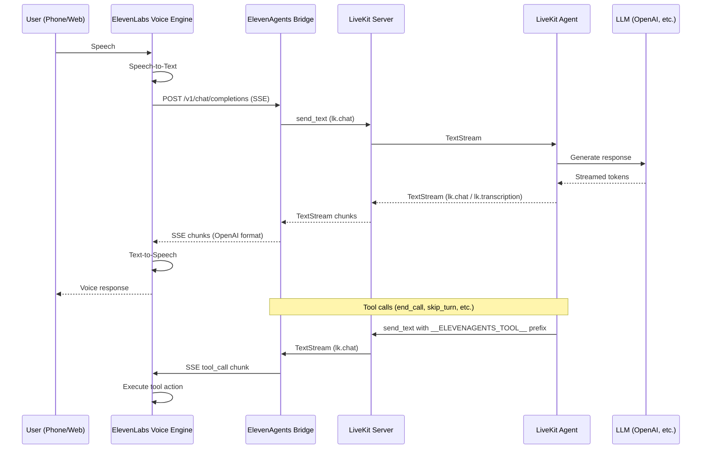

# elevenagents-livekit-plugin

[](https://pypi.org/project/elevenagents-livekit-plugin/)
[](https://pypi.org/project/elevenagents-livekit-plugin/)

Bridge between LiveKit Agents and ElevenAgents Voice Orchestration.

This plugin connects your existing LiveKit text agents to ElevenLabs Conversational AI, giving them a voice interface with zero changes to your agent logic. It acts as a translator between ElevenLabs' OpenAI-compatible API and LiveKit's real-time text streams.

## Architecture



```
+-------------------+       +---------------------+       +------------------+
|                   |  SSE  |                     | Text  |                  |
|  ElevenLabs       |<----->|  ElevenAgents       |<----->|  LiveKit         |
|  Voice Engine     |       |  Bridge             |       |  Server          |
|                   |       |  (FastAPI on :8013)  |       |                  |
+-------------------+       +---------------------+       +------------------+
                                                                  |
                                                                  | TextStream
                                                                  |
                                                           +------+-------+
                                                           |              |
                                                           |  LiveKit     |
                                                           |  Agent       |
                                                           |  (Your code) |
                                                           |              |
                                                           +--------------+
                                                                  |
                                                                  | API call
                                                                  |
                                                           +------+-------+
                                                           |              |
                                                           |  LLM         |
                                                           |  (GPT, etc.) |
                                                           |              |
                                                           +--------------+
```

## How It Works

1. **ElevenLabs** handles speech-to-text and text-to-speech. It sends transcribed user speech to the bridge as an OpenAI-compatible `/v1/chat/completions` request.

2. **The Bridge** extracts the user message and forwards it to the LiveKit room via a text stream on the `lk.chat` topic.

3. **Your LiveKit Agent** receives the text, processes it with your LLM of choice, and streams the response back.

4. **The Bridge** receives the agent's response chunks and formats them as OpenAI SSE events, streaming them back to ElevenLabs.

5. **ElevenLabs** converts the text response to speech and plays it to the user.

For tool calls (like `end_call` or `language_detection`), the agent sends a specially prefixed message on `lk.chat`. The bridge detects the prefix, parses the tool call, and forwards it to ElevenLabs in the OpenAI `tool_calls` format.

## Installation

```bash
pip install elevenagents-livekit-plugin
```

## Quick Start

### 1. Set up your LiveKit Agent

Add `elevenagents_tools()` to your existing LiveKit agent to enable ElevenLabs system tools:

```python
# agent.py
from livekit.agents import Agent, AgentServer, AgentSession, JobContext, cli, room_io
from livekit.plugins import openai
from elevenagents_livekit_plugin import elevenagents_tools

class MyAgent(Agent):
    def __init__(self):
        super().__init__(
            instructions="You are a helpful assistant. Keep responses short.",
            tools=[*elevenagents_tools()],
        )

server = AgentServer()

@server.rtc_session()
async def entrypoint(ctx: JobContext):
    session = AgentSession(
        llm=openai.LLM(model="gpt-4.1-nano"),
    )
    await session.start(
        agent=MyAgent(),
        room=ctx.room,
        room_options=room_io.RoomOptions(
            text_input=True,
            text_output=True,
            audio_input=False,
            audio_output=False,
        ),
    )
    await session.wait_for_inactive()

if __name__ == "__main__":
    cli.run_app(server)
```

### 2. Start the Bridge

Create a simple bridge script:

```python
# bridge.py
from elevenagents_livekit_plugin import ElevenAgentsBridge

bridge = ElevenAgentsBridge(
    room_name="elevenagents-bridge",
    port=8013,
    buffer_words="",
)
bridge.run()
```

### 3. Configure Environment

Create a `.env` file with your LiveKit credentials:

```env
LIVEKIT_URL=ws://localhost:7880
LIVEKIT_API_KEY=your-api-key
LIVEKIT_API_SECRET=your-api-secret
```

### 4. Run Everything

Start your LiveKit server, agent, and bridge:

```bash
# Terminal 1: LiveKit server
livekit-server --dev

# Terminal 2: Your agent
python agent.py dev

# Terminal 3: The bridge
python bridge.py
```

### 5. Connect ElevenLabs

Expose the bridge to the internet (ElevenLabs needs a public URL):

```bash
ngrok http 8013
```

In ElevenLabs Conversational AI settings, set the custom LLM URL to:

```
https://your-ngrok-url.ngrok-free.app/v1
```

ElevenLabs will append `/chat/completions` automatically.

## Configuration

### ElevenAgentsBridge

| Parameter | Default | Description |
|-----------|---------|-------------|
| `livekit_url` | `$LIVEKIT_URL` | LiveKit server WebSocket URL |
| `api_key` | `$LIVEKIT_API_KEY` | LiveKit API key |
| `api_secret` | `$LIVEKIT_API_SECRET` | LiveKit API secret |
| `room_name` | `"elevenagents-bridge"` | LiveKit room name for the bridge |
| `identity` | `"elevenagents-bridge"` | Participant identity in the room |
| `port` | `8013` | HTTP server port |
| `host` | `"0.0.0.0"` | HTTP server bind address |
| `buffer_words` | `"... "` | Text sent immediately while waiting for the agent. Set to `""` to disable. |

### Tool Wait

The bridge waits briefly after the agent's text response for any tool call signals. This is configured in the `LiveKitClient.send_and_stream()` method:

- `timeout` (default `30.0`): Maximum wait for the agent's first response
- `tool_wait` (default `0.5`): Wait time after text finishes for tool signals

## Built-in Tools

The plugin includes ElevenLabs system tools that your agent can call:

### `end_call`

Ends the voice conversation. Called when the user says goodbye or the task is complete.

```python
# Parameters:
#   reason (str, required): Why the call is ending
#   system__message_to_speak (str, optional): Farewell message
```

### `skip_turn`

Pauses the agent and waits for the user to speak. Called when the user needs a moment.

```python
# Parameters:
#   reason (str, optional): Why the pause is needed
```

### `language_detection`

Switches the conversation language.

```python
# Parameters:
#   reason (str, required): Why the switch is needed
#   language (str, required): Target language code (e.g. "es", "fr", "de")
```

### Using Tools

Import and pass to your agent:

```python
from elevenagents_livekit_plugin import elevenagents_tools

class MyAgent(Agent):
    def __init__(self):
        super().__init__(
            instructions="You are a helpful assistant.",
            tools=[*elevenagents_tools()],
        )
```

You can also cherry-pick individual tools if you do not need all of them.

## Compatibility

- Works with both LiveKit OSS and LiveKit Cloud
- Works with any LLM supported by LiveKit Agents (OpenAI, Anthropic, etc.)
- Requires Python 3.10+
- Requires a running LiveKit server and a deployed LiveKit agent

## Project Structure

```
elevenagents-livekit-plugin/
  src/
    elevenagents_livekit_plugin/
      __init__.py          # Public API exports
      bridge.py            # ElevenAgentsBridge main class
      livekit_client.py    # LiveKit room connection and text streaming
      server.py            # FastAPI /v1/chat/completions endpoint
      adapter.py           # OpenAI SSE format conversion
      tools.py             # ElevenLabs system tools (end_call, etc.)
  examples/
    basic.py               # Minimal usage example
  pyproject.toml           # Package metadata and dependencies
```

## License

MIT
